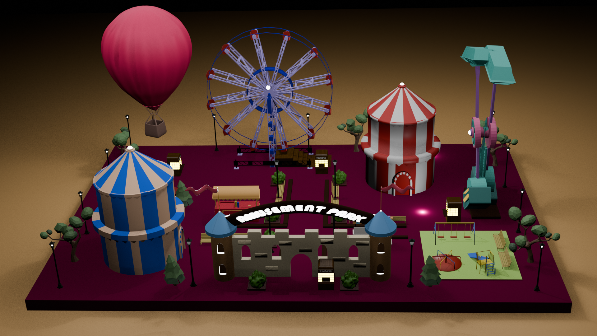

Welcome to *FunFair 3D, a vibrant and imaginative amusement park scene built entirely in **Blender*. This project showcases 3D modeling, texturing, lighting, and rendering techniques—all wrapped up in a fun, carnival-themed environment!

## 📸 Preview

## 🚀 Features

- 🎪 Two uniquely styled 3D tent structures with alternating color patterns
- 🎡 Fully modeled Ferris wheel
- 🎈 Hot air balloon for a sky-high visual touch
- 🎠 Thrilling swing ride
- 🏰 Custom-designed entrance with an “Amusement Park” arch
- 🌳 Stylized trees, benches, and play area for added realism

## 🛠 Tools Used

- [Blender](https://www.blender.org/) (3D modeling, shading, rendering)
- Cycles Render Engine
- Node-based Material Setup
- Lighting & Camera Composition
